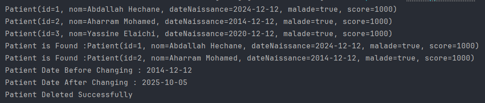

# README - Application Démo Spring Boot

Cette application Spring Boot gère une entité `Patient` avec des opérations CRUD (Créer, Lire, Mettre à jour, Supprimer) en utilisant Spring Data JPA. Elle supporte deux configurations de base de données : H2 (en mémoire) et MySQL. Ce document explique étape par étape le fonctionnement du code principal dans `DemoApplication.java`.

## Prérequis
- **Java** : Version 17 ou supérieure.
- **Maven** : Pour gérer les dépendances.
- **MySQL** : Installé localement pour la configuration MySQL.
- **Dépendances** (dans `pom.xml`) :
  - `spring-boot-starter-data-jpa`
  - `mysql-connector-java` (pour MySQL)
  - `h2` (pour H2 en mémoire)
  - `lombok` (pour réduire le code boilerplate)

## Configuration
Le fichier `application.properties` contient deux configurations possibles :

### 1. Base de données H2 (en mémoire)
```properties
spring.application.name=demo
server.port=8002
spring.h2.console.enabled=true
spring.datasource.url=jdbc:h2:mem:MridMskin
spring.datasource.driver-class-name=org.h2.Driver
spring.jpa.show-sql=false
spring.jpa.properties.hibernate.format_sql=false
spring.jpa.hibernate.ddl-auto=update
```
- **H2 Console** : Accessible via `http://localhost:8002/h2-console` pour visualiser les données.
- **Schéma** : Créé automatiquement avec `ddl-auto=update`.

### 2. Base de données MySQL
```properties
spring.application.name=demo
server.port=8002
spring.jpa.hibernate.ddl-auto=update
spring.datasource.url=jdbc:mysql://localhost:3306/MridMskin?createDatabaseIfNotExist=true
spring.datasource.username=root
spring.datasource.password=
spring.datasource.driver-class-name=com.mysql.cj.jdbc.Driver
```
- **Base de données** : Crée automatiquement la base `MridMskin` si elle n'existe pas.
- **Utilisateur MySQL** : Assurez-vous que l'utilisateur `root` a les privilèges nécessaires.

## Structure du Projet
- **`Patient.java`** : Entité JPA représentant un patient avec les champs `id` (auto-incrémenté), `nom`, `dateNaissance`, `malade`, et `score`.
- **`PatientRepo.java`** : Interface de repository JPA avec des méthodes pour rechercher et supprimer des patients.
- **`DemoApplication.java`** : Classe principale qui exécute des opérations CRUD au démarrage.

## Étapes du Code dans `DemoApplication.java`
Le code dans la méthode `run` de `DemoApplication` exécute les opérations suivantes :

1. **Création de Patients** :
   - Trois patients sont créés et enregistrés dans la base de données avec les attributs suivants :
     - "Abdallah Hechane", date de naissance : 12/12/2024, malade : true, score : 1000.
     - "Aharram Mohamed", date de naissance : 12/12/2014, malade : true, score : 1000.
     - "Yassine Elaichi", date de naissance : 12/12/2020, malade : true, score : 1000.
   - Utilise `Patient.builder()` pour une construction fluide et `java.sql.Date` pour des dates correctes.

2. **Affichage de Tous les Patients** :
   - Récupère tous les patients via `patientRepo.findAll()` et affiche leurs détails avec `toString()`.

3. **Recherche par ID** :
   - Recherche un patient avec l'ID 1 via `patientRepo.findById(1)`.
   - Si trouvé, affiche ses détails.

4. **Recherche par Nom (Contient "mohamed")** :
   - Utilise `patientRepo.findByNomContainsIgnoreCase("mohamed")` pour trouver les patients dont le nom contient "mohamed" (insensible à la casse).
   - Affiche les patients trouvés.

5. **Mise à Jour d'un Patient** :
   - Recherche un patient avec `patientRepo.findOnePatientByName("Mohamed")` (JPQL : `SELECT p FROM Patient p WHERE p.nom LIKE %:x%`).
   - Si trouvé :
     - Affiche la date de naissance initiale.
     - Modifie la date de naissance à 05/10/2025.
     - Enregistre les modifications avec `patientRepo.save()`.
     - Affiche la nouvelle date de naissance.
     - Supprime le patient avec `patientRepo.deleteOnePatientByName("Mohamed")` (JPQL : `DELETE FROM Patient p WHERE p.nom LIKE %:x%`).
     - Confirme la suppression.
   - Sinon, affiche "Patient non trouvé".

6. **Mise à Jour d'un Autre Patient** :
   - Recherche un patient avec `patientRepo.findOnePatientByName("Abd")`.
   - Met à jour le champ `malade` à `false` et enregistre les modifications.

## Repository (`PatientRepo.java`)
- **Méthodes** :
  - `findByNomContainsIgnoreCase` : Recherche les patients par nom (insensible à la casse).
  - `findOnePatientByName` : Recherche un patient par nom avec une requête JPQL utilisant `LIKE`.
  - `deleteOnePatientByName` : Supprime les patients par nom avec une requête JPQL annotée `@Modifying` et `@Transactional`.

## Comment Exécuter
1. Configurez `application.properties` pour utiliser H2 ou MySQL.
2. Assurez-vous que MySQL est en cours d'exécution si vous utilisez la configuration MySQL.
3. Exécutez l'application avec :
   ```bash
   mvn spring-boot:run
   ```
4. Consultez la console pour voir les résultats des opérations CRUD.
5. Pour H2, accédez à `http://localhost:8002/h2-console` pour inspecter la base de données.


Ce projet démontre une gestion simple des entités avec Spring Data JPA, adaptable à H2 ou MySQL.!
## resultat:

## H2:database: 

## Select:H2:database:
 
## Mysql:

## Select Mysql:
